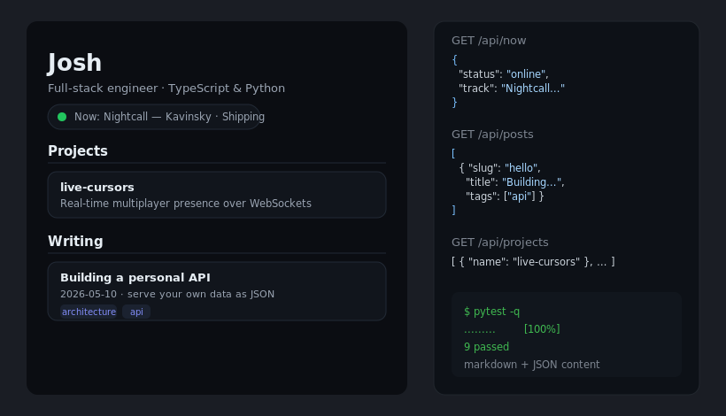

# personal-api

[](https://github.com/JCreatesGH/personal-api/actions)
[](https://www.python.org/)
[](LICENSE)

Your own data API — now-playing, projects, and blog posts as clean JSON — plus a thin portfolio frontend that consumes it. Content lives as markdown + JSON on disk, so publishing a post is just adding a file.



## Run it

```bash
pip install -r requirements.txt
uvicorn app.main:app --reload      # http://localhost:8000  (portfolio + /docs)
```

## API

| Route | Returns |
|-------|---------|
| `GET /api/profile` | name, headline, links |
| `GET /api/now` | now-playing / current activity (wire to Spotify/Last.fm in prod) |
| `GET /api/projects` | project list |
| `GET /api/posts` | post metadata (title, date, summary, tags) |
| `GET /api/posts/{slug}` | full post incl. body |

## Add a blog post

Drop a markdown file in `content/posts/` with front matter:

```markdown
---
title: My new post
date: 2026-06-01
summary: One-line teaser.
tags: [typescript, react]
---
Post body here.
```

Posts are returned newest-first automatically.

## Design

The content layer (`app/content.py`) is a set of **pure functions over a directory** — front-matter parsing, post loading, profile loading — so it's tested against a fixture folder without spinning up the server. The frontend is intentionally "dumb": it just fetches the API and renders.

## Development

```bash
python -m pytest -q   # 9 tests (content parsing + API endpoints)
```

## License

MIT
